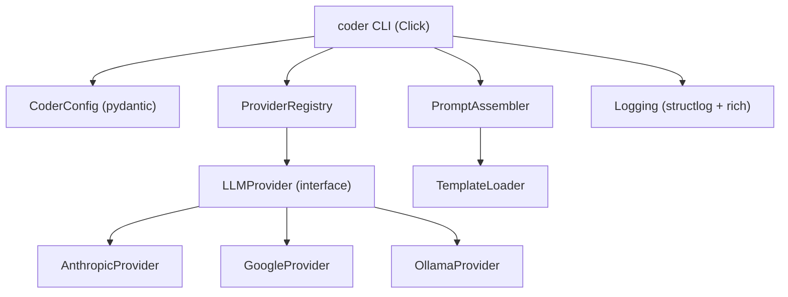

# Design Document: Coder Foundation & Provider Layer

## Overview

The coder foundation provides the infrastructure layer for a multi-model
spec-driven coding agent. It establishes the package structure, a
provider-agnostic LLM interface via LangChain, a filesystem-based prompt
template system with layered assembly, a Click-based CLI, and structured
logging via structlog + rich.

## Architecture



### Module Responsibilities

1. `coder/config.py` — Configuration loading from YAML + env vars, CoderConfig model.
2. `coder/providers.py` — LLMProvider interface, AnthropicProvider, GoogleProvider, OllamaProvider.
3. `coder/registry.py` — ProviderRegistry mapping model names to providers.
4. `coder/templates.py` — TemplateLoader for filesystem template loading with security validation.
5. `coder/prompts.py` — PromptAssembler for 3-layer prompt composition.
6. `coder/cli.py` — Click-based CLI entry point.
7. `coder/logging.py` — Logging setup with structlog + rich.
8. `coder/__init__.py` — Package metadata and public API exports.
9. `coder/_templates/` — Default prompt template files (agent.md, coder.md, reviewer.md).

## Execution Paths

### Path 1: CLI invocation resolves provider and validates run

1. `coder/cli.py: run_command` — Click handler for `coder run`
2. `coder/config.py: load_config()` → `CoderConfig`
3. `coder/logging.py: setup_logging(config)` — configures structlog
4. `coder/registry.py: ProviderRegistry.resolve(model_name)` → `LLMProvider`
5. `coder/providers.py: AnthropicProvider.__init__(model_name)` — validates API key
6. Side effect: logs run parameters, returns validated provider to caller

### Path 2: Prompt assembly for an agent invocation

1. `coder/prompts.py: PromptAssembler.assemble(persona, task_context, variables)` — entry point
2. `coder/templates.py: TemplateLoader.load("agent")` → `str` (base profile)
3. `coder/templates.py: TemplateLoader.load(persona)` → `str` (persona profile)
4. `coder/prompts.py: PromptAssembler._substitute(template, variables)` → `str`
5. Return: concatenated `base + persona + task_context` string

### Path 3: List available models

1. `coder/cli.py: models_command` — Click handler for `coder models`
2. `coder/registry.py: ProviderRegistry.list_models()` → `list[ModelInfo]`
3. Side effect: prints formatted table to stdout via rich

## Components and Interfaces

### CLI Commands

```
coder run <campaign_dir> [--model MODEL] [--repo PATH]
coder models
```

### Core Data Types

```
record CoderConfig:
    model: str                    -- default model name
    templates_dir: str or null    -- custom templates directory path
    ollama_url: str               -- Ollama server URL
    log_level: str                -- logging level
    log_file: str or null         -- optional log file path

record ModelInfo:
    name: str                     -- model name or pattern
    provider: str                 -- provider type (anthropic, google, ollama)
    description: str              -- human-readable description
```

### Module Interfaces

```
interface LLMProvider:
    model_name: str
    invoke(messages: list[BaseMessage], tools: list[Tool] or null) → AIMessage
        -- Send messages to the LLM, optionally with tool definitions
    validate() → null
        -- Verify provider is correctly configured; raise on failure

interface ProviderRegistry:
    resolve(model_name: str) → LLMProvider
        -- Create a provider for the given model name
    register(prefix: str, constructor: callable) → null
        -- Register a custom prefix-to-provider mapping
    list_models() → list[ModelInfo]
        -- Return all known model patterns

interface TemplateLoader:
    load(name: str) → str
        -- Load and return template content by name
    search_paths: list[Path]
        -- Ordered list of directories to search

interface PromptAssembler:
    assemble(persona: str, task_context: str, variables: map[str, str] or null) → str
        -- Compose 3-layer prompt from base + persona + context
```

## Data Models

### Configuration File (`.coder.yaml`)

```yaml
model: claude-opus-4-6
templates_dir: .coder/templates
ollama_url: http://localhost:11434
log_level: DEBUG
log_file: null
```

### Default Template Structure

```
coder/_templates/
  agent.md         -- base agent identity (layer 1)
  coder.md         -- coding persona (layer 2)
  reviewer.md      -- intent verification persona (layer 2)
```

## Operational Readiness

- **Logging**: structlog + rich for human-readable console output; optional
  file sink. All modules use `get_logger(__name__)`.
- **Rollback**: Package is added to the monorepo workspace. Removal requires
  removing the workspace member entry and the `packages/coder/` directory.

## Correctness Properties

### Property 1: Provider Resolution Determinism

*For any* model name string, the `ProviderRegistry` SHALL resolve to exactly
one provider type deterministically: `claude-*` → Anthropic, `gemini-*` →
Google, all others → Ollama.

**Validates: Requirements 3.2, 3.3, 3.4**

### Property 2: Configuration Precedence

*For any* configuration key that is set in multiple sources, the resolved
value SHALL follow the precedence order: environment variable > project
`.coder.yaml` > user `~/.coder/config.yaml` > built-in default.

**Validates: Requirements 4.1, 4.4**

### Property 3: Template Security

*For any* template name string, the `TemplateLoader` SHALL reject the load
if the name contains path separators, `..` sequences, or if the resolved
path is a symlink.

**Validates: Requirements 5.4, 5.5**

### Property 4: Prompt Layer Composition

*For any* persona name and task context, the assembled prompt SHALL contain
the persona profile content and the task context, in that order, separated
by double newlines. If the base profile exists, it SHALL appear before the
persona profile.

**Validates: Requirements 6.1, 6.2**

### Property 5: Safe Template Substitution

*For any* template containing `$variable` placeholders and a variables
dictionary, the assembled prompt SHALL replace matching placeholders with
their values and leave unmatched placeholders unchanged.

**Validates: Requirements 6.3, 6.E1**

## Error Handling

| Error Condition | Behavior | Requirement |
|----------------|----------|-------------|
| Ollama server unreachable | Raise `ProviderConnectionError` | 12-REQ-2.E1 |
| API key missing | Raise `ProviderConfigError` | 12-REQ-2.E2 |
| Empty model name | Raise `ValueError` | 12-REQ-3.E1 |
| Invalid YAML config | Raise `ConfigError` | 12-REQ-4.E3 |
| Unknown config keys | Log warning, ignore | 12-REQ-4.E1 |
| Template not found | Raise `TemplateNotFoundError` | 12-REQ-5.E1 |
| Symlink in template path | Raise `TemplateSecurityError` | 12-REQ-5.5 |
| Campaign dir missing | Print error, exit 1 | 12-REQ-7.E1 |
| Provider creation fails | Print error, exit 1 | 12-REQ-7.E2 |
| Log file not writable | Warn, console-only | 12-REQ-8.E1 |

## Technology Stack

- **Language**: Python 3.14+
- **Package manager**: uv (workspace member)
- **LLM providers**: langchain-anthropic, langchain-google-genai, langchain-ollama
- **CLI**: Click 8.1+
- **Configuration**: PyYAML, pydantic
- **Logging**: structlog, rich
- **Type checking**: mypy (strict)
- **Linting**: ruff

## Definition of Done

A task group is complete when ALL of the following are true:

1. All subtasks within the group are checked off (`[x]`)
2. All spec tests (`test_spec.md` entries) for the task group pass
3. All property tests for the task group pass
4. All previously passing tests still pass (no regressions)
5. No linter warnings or errors introduced
6. Code is committed on a feature branch
7. `tasks.md` checkboxes are updated to reflect completion

## Testing Strategy

- **Unit tests**: Each module tested in isolation with mocked dependencies.
  Provider tests mock LangChain chat models. Template tests use temporary
  directories.
- **Property tests**: Hypothesis-based tests for provider resolution
  determinism, config precedence, template security, and prompt composition.
- **Integration tests**: CLI smoke tests using Click's test runner. Provider
  instantiation tests (Anthropic/Google with env var stubs, Ollama with
  connectivity check).
