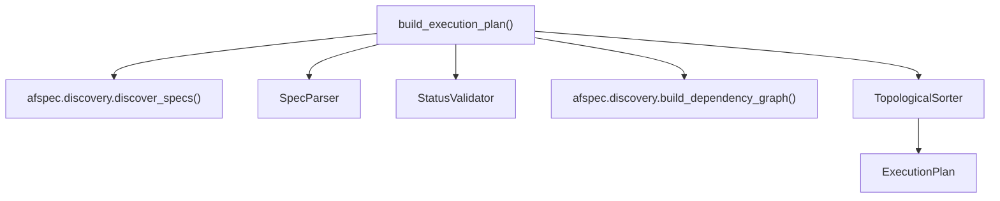

# Design Document: Spec Analysis & Execution Planning

## Overview

The planning layer reads a campaign directory, discovers spec packs using
afspec utilities, parses their artifacts into structured models, validates
spec status, computes implementation order via dependency analysis, and
produces an `ExecutionPlan` that the TDD engine consumes.

## Architecture



### Module Responsibilities

1. `coder/planner.py` — `build_execution_plan()` entry point, orchestrates
   discovery → parse → validate → sort → plan.
2. `coder/spec_parser.py` — Parse spec pack folders into `ParsedSpec` models
   using afspec's I/O utilities.
3. `coder/models.py` — Data models: `ParsedSpec`, `ExecutionPlan`.

## Execution Paths

### Path 1: Build execution plan from campaign directory

1. `coder/planner.py: build_execution_plan(campaign_dir)` — entry point
2. `afspec/discovery.py: discover_specs(campaign_dir)` → `list[SpecMeta]`
3. `coder/spec_parser.py: SpecParser.parse(spec_meta)` → `ParsedSpec` (per spec)
4. `coder/planner.py: _filter_active(parsed_specs)` → `list[ParsedSpec]`
5. `afspec/discovery.py: build_dependency_graph(active_metas, campaign_dir)` → `DependencyGraph`
6. `coder/planner.py: _topological_sort(graph, active_specs)` → `list[ParsedSpec]`
7. Return: `ExecutionPlan(specs=sorted_specs, count=len(sorted_specs))`

## Components and Interfaces

### Core Data Types

```
record ParsedSpec:
    meta: SpecMeta                    -- from afspec.discovery
    requirements: Requirements        -- from afspec.models
    test_spec: TestSpec               -- from afspec.models
    tasks: Tasks                      -- from afspec.models
    prd_text: str                     -- raw markdown content of prd.md

record ExecutionPlan:
    specs: list[ParsedSpec]           -- ordered for implementation
    count: int                        -- total number of specs
    timestamp: str                    -- ISO 8601 creation timestamp
```

### Module Interfaces

```
interface SpecParser:
    parse(meta: SpecMeta) → ParsedSpec
        -- Load and parse all artifacts from a spec folder

function build_execution_plan(campaign_dir: Path, spec_filter: list[str] or null) → ExecutionPlan
    -- Discover, parse, validate, sort, and return execution plan
```

## Data Models

### ExecutionPlan JSON (for debugging/logging)

```json
{
  "specs": [
    {
      "meta": {"spec_id": 1, "spec_name": "base_app", "status": "active"},
      "requirements": { "...": "..." },
      "test_spec": { "...": "..." },
      "tasks": { "...": "..." },
      "prd_text": "# PRD: Base App\n..."
    }
  ],
  "count": 1,
  "timestamp": "2026-06-13T10:00:00Z"
}
```

## Operational Readiness

- **Logging**: Each step logs at DEBUG level (discovery count, parse status,
  skipped specs, dependency edges, final ordering).
- **Error reporting**: Parse errors include file path and line number.
  Cycle errors include the cycle path.

## Correctness Properties

### Property 1: Topological Order Respects Dependencies

*For any* dependency graph where spec A depends on spec B, the execution
plan SHALL place B before A in the ordered list.

**Validates: Requirements 4.2**

### Property 2: Active-Only Filtering

*For any* campaign with mixed-status specs, the execution plan SHALL
contain only specs with `active` status.

**Validates: Requirements 3.1, 3.3**

### Property 3: Stable Sort by Numeric Prefix

*For any* set of specs with no dependency relationship between them, the
execution plan SHALL order them by ascending numeric prefix.

**Validates: Requirements 4.4**

### Property 4: Cycle Detection

*For any* dependency graph containing a cycle, `build_execution_plan`
SHALL raise `DependencyCycleError` rather than returning a partial plan.

**Validates: Requirements 4.3**

## Error Handling

| Error Condition | Behavior | Requirement |
|----------------|----------|-------------|
| Campaign dir missing | Raise `FileNotFoundError` | 13-REQ-6.E1 |
| Empty campaign | Return empty plan | 13-REQ-1.E1 |
| Missing JSON artifact | Raise `SpecParseError` | 13-REQ-2.E1 |
| Invalid JSON syntax | Raise `SpecParseError` | 13-REQ-2.E2 |
| Missing prd.md | Set empty string, warn | 13-REQ-2.E3 |
| Unknown status | Treat as draft, warn | 13-REQ-3.E1 |
| External dependency | Warn, treat as satisfied | 13-REQ-4.E1 |
| Dependency cycle | Raise `DependencyCycleError` | 13-REQ-4.3 |

## Technology Stack

- **Language**: Python 3.14+
- **Dependencies**: afspec (models, discovery), pydantic
- **No LLM dependencies** — this is a deterministic planning module

## Definition of Done

A task group is complete when ALL of the following are true:

1. All subtasks within the group are checked off (`[x]`)
2. All spec tests (`test_spec.md` entries) for the task group pass
3. All property tests for the task group pass
4. All previously passing tests still pass (no regressions)
5. No linter warnings or errors introduced
6. Code is committed on a feature branch
7. `tasks.md` checkboxes are updated to reflect completion

## Testing Strategy

- **Unit tests**: SpecParser tested with fixture spec pack directories.
  Planner tested with mocked afspec discovery functions.
- **Property tests**: Hypothesis-based tests for topological ordering,
  active-only filtering, and cycle detection.
- **Integration tests**: End-to-end plan building from the example spec
  packs in the repo.
