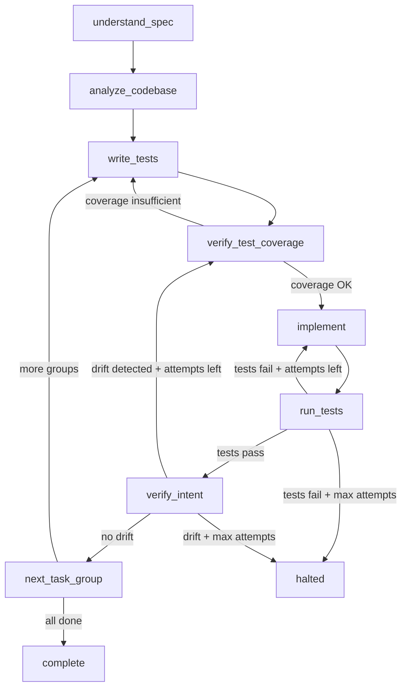
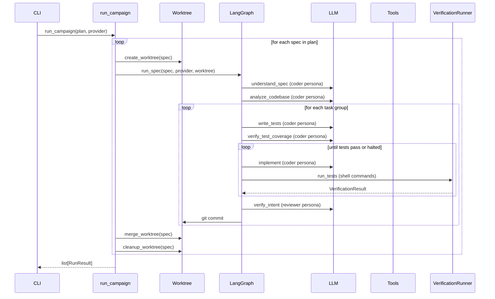

# Design Document: TDD Execution Engine (LangGraph)

## Overview

The execution engine is a LangGraph state machine implementing the 9-step
TDD coding workflow. Each step is a graph node. Conditional edges encode
retry and loop-back logic. The engine operates within a git worktree for
isolation and uses LangChain tools for file I/O and shell access.

## Architecture





### Module Responsibilities

1. `coder/graph.py` — LangGraph state machine: node definitions, edge
   routing, graph construction.
2. `coder/nodes.py` — Individual node implementations (understand_spec,
   analyze_codebase, write_tests, etc.).
3. `coder/tools.py` — LangChain tool definitions (read_file, write_file,
   run_command, list_directory).
4. `coder/worktree.py` — Git worktree lifecycle (create, merge, cleanup).
5. `coder/verify.py` — Verification runner (execute test commands).
6. `coder/state.py` — Run state persistence (_run.json).
7. `coder/runner.py` — `run_spec()` and `run_campaign()` entry points.

## Execution Paths

### Path 1: Execute single spec via run_spec

1. `coder/runner.py: run_spec(parsed_spec, provider, worktree_path, config)` — entry
2. `coder/graph.py: build_graph(provider, tools, config)` → `CompiledGraph`
3. `coder/graph.py: graph.invoke(initial_state)` — runs the state machine
4. `coder/nodes.py: understand_spec(state)` → updated state with `spec_context`
5. `coder/nodes.py: analyze_codebase(state)` → updated state with `codebase_analysis`
6. `coder/nodes.py: write_tests(state)` → updated state (tests written via tools)
7. `coder/nodes.py: verify_test_coverage(state)` → updated state with `coverage_ok`
8. `coder/nodes.py: implement(state)` → updated state (code written via tools)
9. `coder/verify.py: VerificationRunner.run(test_commands)` → `VerificationResult`
10. `coder/nodes.py: verify_intent(state)` → updated state with `drift_detected`
11. Return: `RunResult(success=True, ...)`

### Path 2: Worktree lifecycle for a spec

1. `coder/worktree.py: create_worktree(repo_path, spec_slug, model_name)` → `WorktreeInfo`
2. `coder/runner.py: run_spec(...)` — all work in worktree
3. `coder/worktree.py: commit_task_group(worktree, group_num, title)` — git commit
4. `coder/worktree.py: merge_worktree(worktree, source_branch)` — fast-forward merge
5. `coder/worktree.py: cleanup_worktree(worktree)` — remove worktree + prune
6. Side effect: worktree merged into source branch, worktree removed

### Path 3: Campaign execution iterates specs

1. `coder/runner.py: run_campaign(plan, provider, repo_path, config)` — entry
2. Loop: for each `parsed_spec` in `plan.specs`:
3. `coder/worktree.py: create_worktree(repo_path, spec.slug, provider.model_name)` → `WorktreeInfo`
4. `coder/runner.py: run_spec(parsed_spec, provider, worktree.path, config)` → `RunResult`
5. If success: `coder/worktree.py: merge_worktree(worktree, source_branch)`
6. `coder/worktree.py: cleanup_worktree(worktree)`
7. Return: `list[RunResult]`

## Components and Interfaces

### Core Data Types

```
record CoderState (TypedDict):
    current_phase: str
    current_task_group: int
    attempt_count: int
    max_attempts: int
    test_results: str
    spec_context: str
    codebase_analysis: str
    coverage_ok: bool
    drift_detected: bool
    messages: list[BaseMessage]
    halted: bool
    halt_reason: str
    history: list[StateTransition]

record StateTransition:
    phase: str
    task_group: int
    attempt: int
    timestamp: str
    result: str or null

record VerificationResult:
    passed: bool
    exit_code: int
    stdout: str
    stderr: str
    command: str
    elapsed_seconds: float

record WorktreeInfo:
    path: Path
    branch: str
    spec_slug: str
    source_branch: str

record RunResult:
    success: bool
    spec_name: str
    task_groups_completed: int
    total_task_groups: int
    total_tokens: int
    elapsed_seconds: float
    halt_reason: str or null
```

### Module Interfaces

```
interface VerificationRunner:
    run(test_commands: TestCommands, worktree_path: Path) → VerificationResult
        -- Execute test commands and return results

function create_worktree(repo_path: Path, spec_slug: str, model_name: str) → WorktreeInfo
    -- Create an isolated git worktree for spec execution

function merge_worktree(worktree: WorktreeInfo) → bool
    -- Fast-forward merge worktree branch into source branch

function cleanup_worktree(worktree: WorktreeInfo) → null
    -- Remove worktree directory and prune git registry

function run_spec(spec: ParsedSpec, provider: LLMProvider, worktree: Path, config: CoderConfig) → RunResult
    -- Build and execute the LangGraph workflow for one spec

function run_campaign(plan: ExecutionPlan, provider: LLMProvider, repo: Path, config: CoderConfig) → list[RunResult]
    -- Iterate over specs in plan order, run each, collect results

function build_graph(provider: LLMProvider, tools: list[Tool], config: CoderConfig) → CompiledGraph
    -- Construct the LangGraph state machine with all nodes and edges
```

## Data Models

### _run.json (Run State)

```json
{
  "spec_name": "01_base_app",
  "model": "claude-opus-4-6",
  "current_phase": "implement",
  "current_task_group": 2,
  "attempt_count": 1,
  "max_attempts": 5,
  "halted": false,
  "halt_reason": null,
  "started_at": "2026-06-13T10:00:00Z",
  "updated_at": "2026-06-13T10:05:00Z",
  "history": [
    {"phase": "understand_spec", "task_group": 1, "attempt": 0, "timestamp": "...", "result": "ok"},
    {"phase": "write_tests", "task_group": 1, "attempt": 0, "timestamp": "...", "result": "ok"}
  ]
}
```

## Operational Readiness

- **Logging**: Every node logs entry/exit with phase name, task group, and
  attempt count. Verification results are logged at INFO level.
- **State persistence**: `_run.json` written after every node transition.
- **Error containment**: `run_campaign` catches unhandled exceptions per spec
  and records them as failed results.

## Correctness Properties

### Property 1: Monotonic Task Group Progress

*For any* successful spec execution, the task group number SHALL increase
monotonically — the workflow never revisits a completed task group.

**Validates: Requirements 7.1, 7.3**

### Property 2: Retry Bound

*For any* task group, the number of implementation attempts SHALL not exceed
`max_attempts`. If reached, the workflow halts.

**Validates: Requirements 3.2, 3.6**

### Property 3: Path Containment

*For any* file path passed to a tool, the resolved absolute path SHALL be
within the worktree directory. Paths that escape the worktree are rejected.

**Validates: Requirements 4.5**

### Property 4: Worktree Isolation

*For any* spec execution, all file modifications SHALL occur within the
worktree directory, not in the original repository root.

**Validates: Requirements 5.2**

### Property 5: Commit After Success

*For any* task group that completes (all tests pass), exactly one commit
SHALL be created with the conventional message format.

**Validates: Requirements 7.2**

### Property 6: State Persistence Completeness

*For any* node transition, the `_run.json` file SHALL be updated before
the next node begins execution.

**Validates: Requirements 8.1**

### Property 7: Verification Exit Code Semantics

*For any* shell command execution, exit code 0 SHALL map to `passed=True`
and any non-zero exit code SHALL map to `passed=False`.

**Validates: Requirements 6.3**

## Error Handling

| Error Condition | Behavior | Requirement |
|----------------|----------|-------------|
| LLM empty response | Increment attempt, retry | 14-REQ-2.E1 |
| Max attempts exceeded | Halt with reason | 14-REQ-3.6 |
| Command timeout | Return timeout failure | 14-REQ-4.E1 |
| Binary file read | Return error message | 14-REQ-4.E2 |
| Symlink write | Reject with security error | 14-REQ-4.E3 |
| Stale worktree exists | Remove and recreate | 14-REQ-5.E1 |
| Worktree creation fails | Raise WorktreeError | 14-REQ-5.E2 |
| Merge fails (diverged) | Log error, keep worktree | 14-REQ-5.5 |
| Empty test command | Skip, warn | 14-REQ-6.E1 |
| Test binary not found | Return fail result | 14-REQ-6.E2 |
| Commit fails | Warn, continue | 14-REQ-7.E1 |
| State write fails | Warn, continue | 14-REQ-8.E1 |
| Unhandled exception in run_spec | Catch, record, continue | 14-REQ-9.E1 |

## Technology Stack

- **Language**: Python 3.14+
- **Workflow**: langgraph
- **LLM interface**: langchain-core (BaseChatModel, BaseMessage)
- **Tools**: langchain-core `@tool` decorator
- **Git operations**: subprocess calls to `git`
- **Shell execution**: `asyncio.create_subprocess_exec`

## Definition of Done

A task group is complete when ALL of the following are true:

1. All subtasks within the group are checked off (`[x]`)
2. All spec tests (`test_spec.md` entries) for the task group pass
3. All property tests for the task group pass
4. All previously passing tests still pass (no regressions)
5. No linter warnings or errors introduced
6. Code is committed on a feature branch
7. `tasks.md` checkboxes are updated to reflect completion

## Testing Strategy

- **Unit tests**: Each node tested with mocked LLM provider. Tool tests use
  temporary directories. Worktree tests use bare git repos.
- **Property tests**: Hypothesis for path containment, retry bounds, and
  state transition invariants.
- **Integration tests**: Full graph execution with a mock LLM that returns
  canned responses. Worktree lifecycle in a real git repo.
