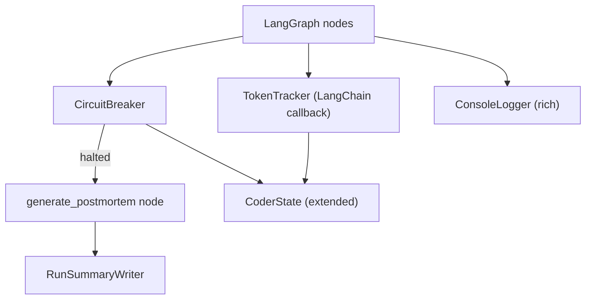
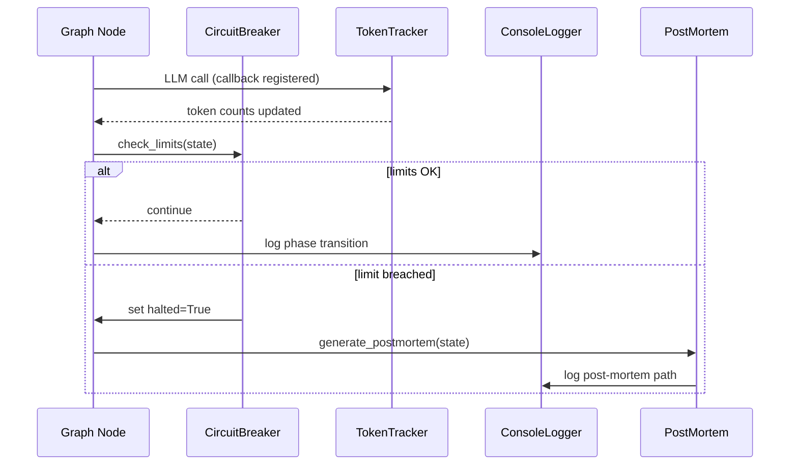

# Design Document: Safety & Observability

## Overview

The safety layer wraps the LangGraph execution engine with circuit breakers,
token tracking, post-mortem generation, and verbose console logging. It
integrates into the existing graph state and node structure from spec 14,
adding a `generate_postmortem` terminal node and a `CircuitBreaker` class
that checks limits at each node transition.

## Architecture





### Module Responsibilities

1. `coder/circuit.py` — CircuitBreaker: check attempt, time, and token
   limits against graph state.
2. `coder/tokens.py` — TokenTracker: LangChain callback handler that
   accumulates token counts across providers.
3. `coder/postmortem.py` — Post-mortem document generation from graph state.
4. `coder/console.py` — Rich-based console output for phase transitions,
   test results, and progress.
5. `coder/summary.py` — Run summary document generation.

## Execution Paths

### Path 1: Circuit breaker checks at node transition

1. `coder/graph.py: node_wrapper(node_fn)` — wraps each node
2. `coder/circuit.py: CircuitBreaker.check(state)` → `CheckResult`
3. If `CheckResult.halted`: set `state["halted"]=True`,
   `state["halt_reason"]=reason`
4. `coder/graph.py: route_to_postmortem(state)` — conditional edge
5. `coder/postmortem.py: generate_postmortem(state, worktree)` → writes
   `_postmortem.md`
6. Side effect: post-mortem file created, path logged

### Path 2: Token tracking during LLM call

1. `coder/providers.py: LLMProvider.invoke(messages, tools, callbacks=[tracker])` — entry
2. LangChain calls `TokenTracker.on_llm_end(response)` — callback
3. `coder/tokens.py: TokenTracker._update(response.llm_output)` — accumulate
4. Return: `tracker.total_tokens` available for circuit breaker check

### Path 3: Console logging at each phase

1. `coder/console.py: ConsoleLogger.log_transition(phase, group, attempt)` — entry
2. `rich.console.Console.print(formatted_line)` — colored output
3. Side effect: progress line printed to stderr

### Path 4: Run summary generation

1. `coder/summary.py: write_run_summary(state, worktree, token_tracker)` — entry
2. `coder/summary.py: _format_summary(state, tokens, elapsed)` → `str`
3. Write `_run_summary.md` to worktree
4. `coder/console.py: ConsoleLogger.print_summary(summary)` — console output
5. Side effect: summary file created, condensed version printed

## Components and Interfaces

### Core Data Types

```
record CheckResult:
    halted: bool
    reason: str or null

record SafetyConfig:
    max_attempts_per_task: int or null    -- null = unlimited
    max_wall_time_seconds: int or null    -- null = unlimited
    max_tokens: int or null               -- null = unlimited

record TokenUsage:
    input_tokens: int
    output_tokens: int
    total_tokens: int                     -- computed: input + output
    call_count: int
```

### Module Interfaces

```
interface CircuitBreaker:
    __init__(config: SafetyConfig, start_time: float)
    check(state: CoderState, token_tracker: TokenTracker) → CheckResult
        -- Check all limits against current state

interface TokenTracker (extends BaseCallbackHandler):
    input_tokens: int
    output_tokens: int
    total_tokens: int                     -- property: input + output
    call_count: int
    on_llm_end(response: LLMResult) → null
        -- Accumulate tokens from LLM response metadata
    to_dict() → map[str, int]
        -- Return token breakdown as dictionary

interface ConsoleLogger:
    log_transition(phase: str, task_group: int, attempt: int, max_attempts: int) → null
    log_test_result(result: VerificationResult) → null
    log_token_usage(tracker: TokenTracker, elapsed: float) → null
    print_summary(summary: str) → null

function generate_postmortem(state: CoderState, worktree: Path, tracker: TokenTracker) → Path
    -- Generate _postmortem.md and return its path

function write_run_summary(state: CoderState, worktree: Path, tracker: TokenTracker) → Path
    -- Generate _run_summary.md and return its path
```

## Data Models

### Safety Configuration (`.coder.yaml`)

```yaml
safety:
  max_attempts_per_task: 5
  max_wall_time_seconds: 1800
  max_tokens: 2000000
```

### Post-mortem Document Structure

```markdown
# Post-mortem: <spec_name>

## Summary
Execution halted: <1-2 sentence description>.

## Halt Reason
- **Limit breached:** <which limit>
- **Current value:** <value at halt>
- **Configured limit:** <limit value>

## Execution Context
- **Spec:** <spec_name>
- **Model:** <model_name>
- **Phase at halt:** <current_phase>
- **Task group:** <N> of <total>
- **Attempt:** <N> of <max>

## Attempt History
| # | Phase | Task Group | Attempt | Time | Result |
|---|-------|------------|---------|------|--------|
| 1 | understand_spec | 1 | 0 | 10:00:01 | ok |
| ... | ... | ... | ... | ... | ... |

## Last Test Output
```
<stdout + stderr from most recent verification>
```

## Token Usage
- Input tokens: <N>
- Output tokens: <N>
- Total tokens: <N>
- LLM calls: <N>

## Recommendations
- <actionable suggestion 1>
- <actionable suggestion 2>
```

## Operational Readiness

- **Logging**: All safety events logged at WARNING level (circuit breaker
  trips, missing token metadata, SIGINT received).
- **Graceful degradation**: If post-mortem or summary writing fails, errors
  are logged but execution continues shutdown sequence.

## Correctness Properties

### Property 1: Halt Guarantee

*For any* execution where a circuit breaker limit is breached, the workflow
SHALL halt within one additional node transition — it SHALL NOT continue
executing further workflow nodes.

**Validates: Requirements 1.4, 5.1**

### Property 2: Token Monotonicity

*For any* sequence of LLM calls, the `TokenTracker.total_tokens` SHALL
be monotonically non-decreasing.

**Validates: Requirements 2.1, 2.3**

### Property 3: Post-mortem Completeness

*For any* halted execution, the generated post-mortem SHALL contain all
required sections: Summary, Halt Reason, Execution Context, Attempt
History, Last Test Output, Token Usage, Recommendations.

**Validates: Requirements 3.2**

### Property 4: Configuration Defaults

*For any* missing safety configuration key, the system SHALL use the
documented default value rather than treating the limit as zero (which
would cause immediate halt).

**Validates: Requirements 1.1, 1.2, 1.3, 1.E2**

## Error Handling

| Error Condition | Behavior | Requirement |
|----------------|----------|-------------|
| Zero/negative limits | Raise ConfigError | 15-REQ-1.E1 |
| Null limit | Treat as unlimited | 15-REQ-1.E2 |
| Missing token metadata | Warn, report zero | 15-REQ-2.E1 |
| Post-mortem I/O failure | Log error, continue | 15-REQ-3.4 |
| No worktree for post-mortem | Write to cwd | 15-REQ-3.E1 |
| Non-TTY terminal | Plain text output | 15-REQ-4.E1 |
| SIGINT received | Graceful shutdown | 15-REQ-5.E1 |
| Summary write failure | Log warning, console only | 15-REQ-6.E1 |

## Technology Stack

- **Language**: Python 3.14+
- **Console output**: rich
- **LLM callbacks**: langchain-core BaseCallbackHandler
- **Signal handling**: Python `signal` module
- **Configuration**: pydantic (SafetyConfig model)

## Definition of Done

A task group is complete when ALL of the following are true:

1. All subtasks within the group are checked off (`[x]`)
2. All spec tests (`test_spec.md` entries) for the task group pass
3. All property tests for the task group pass
4. All previously passing tests still pass (no regressions)
5. No linter warnings or errors introduced
6. Code is committed on a feature branch
7. `tasks.md` checkboxes are updated to reflect completion

## Testing Strategy

- **Unit tests**: CircuitBreaker tested with synthetic state and various
  limit configurations. TokenTracker tested with mocked LLM responses
  from each provider. PostMortem tested with fixture state.
- **Property tests**: Hypothesis for halt guarantee, token monotonicity,
  and configuration defaults.
- **Integration tests**: Full halt-and-recover sequence with mock LLM.
  Console output captured and verified.
